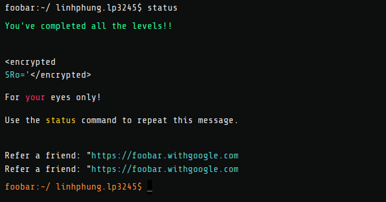

# google-foobar

## Introduction
- What is this? 
  
    Google Foobar is a renowned coding competition that was once shrouded in secrecy, often considered as a secret recruitment test. However, it has evolved into a highly competitive challenge that is difficult to secure an invitation for and even more challenging to complete.

- How did I get an invitation?

    I remember receiving the invitation while reviewing the architectures of some Deep Learning models. So, most likely, searching for something related to programming in Python would increase your chances of receiving the invitation.

- What is included in this Repository?

    This repository includes my solutions to the problems and I'll do my best to provide brief explanations for solutions starting from level 3 and above.

- What does one need to solve the problems?

    For problems from level 1 to 3, a basic understanding and regular practice of Data Structures and Algorithms (DSA) questions would be sufficient. However, for levels 4 and 5, you may need some knowledge in areas such as Mathematics (including uncommon math concepts like Group Theory for level 5), Graph Theory, a good imagination, and, of course, the power of Google search!

## Competition Structure
The Google Foobar competition is structured into five levels, each level presenting a distinct set of challenges. My set of problems across the levels is as follows:

- Level 1: 1 problem
  - [Minion Work Assignments](level1/minion-work-assignments)
- Level 2: 2 problems. After completing this level, you will receive an invitation link.
  - [Bunny Worker Location](level2/bunny-worker-locations/)
  - [Gearing Up for Destruction](level2/gearing-up-for-destruction/)
- Level 3: 3 problems. As far as I remember, after completing this level, you will be prompted to provide some personal information, which is stated to be used for Google recruitment.

  - [Bomb Baby](level3/bomb-baby/)
  - [Find the Access Codes](level3/find-the-access-codes/)
  - [Queue to Do](level3/queue-to-do/)
- Level 4: 2 problems. After completing this level, you'll receive another invitation link.

  - [Bringing a Gun to a Trainer Fight](level4/bringing-a-gun-to-a-trainer-fight/)
  - [Distract the Trainers](level4/distract-the-trainers/)
- Level 5: 1 problem. After completing the final level, you will be asked for your preference in solving future Foobar problems and provided with an encrypted code (although, at this point, I'm feeling quite lazy to decode it).
  - [Disorderly Escape](level5/disorderly-escape/)
  
## Takeaways

The problems in the last two levels are both enjoyable and challenging to solve, especially for someone like me who hasn't tackled competitive programming questions in ages. I remember dedicating full two days to studying Group and Number Theory for the last problem, which resulted in an existential crisis as I questioned what on earth I was doing. However, despite the challenges, I strongly believe it's worth giving it a try, and it serves as a great break from my usual focus on AI.

After completing this challenge, I feel motivated to dive back into solving math and competitive programming problems because, somehow, my heart is still in it. Besides, as I've come to realize just how terrible my math skills are at the moment, what better way to improve than by practicing more?

